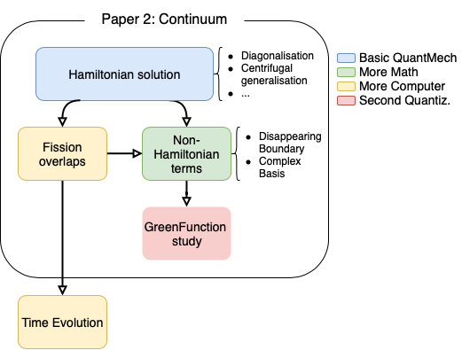

# The Master Plan

Right now Schroedinger is a unique piece of software in search of use cases. 
Its uniqueness sits on the flexible definition of the basis as Singleton, and OO construction of the Hilbert space (basis) and Hamiltonian (potential). 
The particle then move in the world constructed above, and this is guaranteed by the Schroedinger solver (Numerov).

Of course this is nothing new and Schroedinger equations solvers have been used since computers existed. However, the difficult part and the hard ground is laid down. Now, with the right work, the possibility of easily extending basis provides with opportunities both scientifically and computationally.

The plan for the publication and scientific usefulness of Schroedinger can move on two related, but independent, tracks. 
The prerequisites suggested for each milestone with the objective of publication are defined below. 
If you would like to contribute without satisfying the prerequisites, you are welcome and we will do our best to filling the gaps. Moreover, this could be an excellent didactic opportunity to learn, that fits in my pedagogical experiment and might merit a separate publication.

Every contributor to the project will be properly accredited.

## [Publication 1] Template basis change

### Prerequisites

- Linear Algebra\*
- Calculus\* (eventually up to Fourier transform)
- Complex numbers and vector spaces on complex field
- Network theory

### Project

The project aim to automatize the definition of basis, which is one of the most important, but overlooked part of any quantum mechanical calculation. The reason why physicist grudge to explore different bases for their calculations is because of the heavy handed calculations (analytical and/or computational) involved. Therefore, very often the market is full of a fauna of codes, with the only difference being the definition of the basis and related solver. The setup of basis as singleton template in Schroedinger have the potential to change that.

The quantum mechanical wavefunctions live in an Hilbert space, that is a complex vector field of arbitrary dimension with the definition of inner product. The Hilbert space is described by a (complete) basis, that is a set of vectors. A familiar example of a basis is the cartesian set, made by the unitary vectors corresponding to the perpendicular directions that defines the coordinates (usually in 2 or 3 Dimensions denoted with x,y,z). 

Changing basis implies the construction of a transformation (isomorphism) from one set of coordinate to the other, often in matrix form. For example rotating the x and y axes. This operation is necessary to define the interaction, that is usually given in coordinate form (e.g. the Coulomb interaction ~1/r ) but that we might want to use in another basis for solver convenience. This is also an important factor to obtain the fastest convergence of the calculation (necessarty to obtain the physically correct result).

The objectives of this problem are to set up:
- easy, flexible, initialization of the basis class (mostly done);
- rules for deducing solver behaviour according to the basis;
- change of basis routine with automated calculus.

This project will not concern physics cases or properties. Therefore, the knowledge of quantum mechanics is only needed for checking the convergence/correctness of the solution. That can be done setting up progressive testing checks. However the concept of basis is rooted in linear algebra

#### Initialization of Basis

The current initialization of the basis is quite mature, but could be improved. It is based on a singleton class `basis`, that is initialized according to a step-by-step construction or by using a template for the cartesian coordinate system. The step-by-step construction is based on two different classes `discreteBasis` e `continuousBasis`, representing either discrete quantum numbers (e.g. angular momentum) or continuous variables (e.g. position). 
Instantiation of an arbitrary number of discrete or continuous components in the `basis` class, guarantees maximum possible flexibility.

What is missing right now, is a link between basis and solver rules. A quick fix might be checking some pre-made templates (e.g. adding the centrifugal term in the cases requested below) and requesting an explicit potential representation for the general case. I suggest considering this the case. My impression is that something more advanced and flexible can be thought through, but that would consist in bibliographic search or even new work for a theoretical physicist/mathematician.

The missing ingredient for a first usable case, is to implement the following templates, in order of priority:
- 3D spherical:  , but the angular part is left implicit and resolved mainly through spherical harmonics . _Would be nice to implement as well but the explicit calculation is not requested for the moment_.
- Harmonic oscillator (there is the routine for the calculation of the harmonic oscillator in cartesian basis), I have the C++ routines for the calculation in spherical basis both for coordinate and momentum space (but 3D spherical has to be implemented before). If you remember your linear algebra, Harmonic oscillator is a basis for the Hilbert space (and , and many other stuff). It acts as a discretization of the continuous variable , that is therefore replaced by the harmonic oscillator node number .
- 3D cylindrical: , angular part covered with Bessel function in the case of 0 boundary condition (cf. below). _Would be nice to implement as well but the explicit calculation is not requested for the moment_.
- 2D polar basis: , angular part covered with Bessel function in the case of 0 boundary condition (cf. below). _Would be nice to implement as well but the explicit calculation is not requested for the moment_.
- Momentum basis, is the Fourier transform of the coordinate basis.
- An additional point that would be extremely powerful would be the use of previously calculated numerical solution as basis for future calculations. E.g., solve the system with the Coulomb potential in 3D, the obtained (numerical) Coulomb 3D wavefunction can be used as basis for a perturbed Coulomb calculation (this would be key for a physics publication, cf. [Paper2](#Fission-overlaps)).

What is also missing, which is not a basis per-se but can be considered part of the initialization and description of the model space are the boundary conditions. These are sometimes implicit in the type of basis (e.g. Harmonic Oscillator), but often different type of basis are applicable to the same cartesian coordinate. Right now null boundary conditions are implemented ( wavefunction = 0 at the border ). But the implementation of the other types could be envisaged for completeness. 
There are in total [three types of general boundary conditions](http://mathworld.wolfram.com/BoundaryConditions.html) and ideally all three could be implement, but in particular:

- Dirichlet boundary conditions: value of the function and derivative on a surface/border. Right now numerov looks for wf = 0 at border, but could be easily generalized keeping the null case as default template.
- Neumann boundary conditions: value of derivative at a given value (in particular = 0)
- Periodic boundary condition: value of function and all derivatives matching left and right. Like in pac-mac if you go out of the screen on the right you appear on the left side, making sure the opposide side of the boundary have the same value of function and derivatives does just that. This is important to simulate continuous matter like metals and neutron stars. In 2 and 3D is less trivial, and would be further complicated by a dynamical mesh, that we don't have to do. But is solvable, cf. [arXiv 1703-03930](https://arxiv.org/pdf/1703.03930.pdf). PS: as you can see, at this point it start be publishable-ish material in computer science.
- Cauchy boundary condition: constraint on values of both function and derivative (e generalized version of periodic).

The implementation of the boundary condition will impact the solver rules.

#### Solver rules

The solver is the central part of the program and is where the actual calculation of the 1 body Schroedinger (differential) equation is actually done. Right now it is implemented a Numerov solver, that is a solver of second order partial differential equations. The actual type of equation to be solved depends on the basis and therefore the current Numerov solver will be inadequate. E.g. in the case of momentum space, the kinetic term that is currently the source of the second order differentiation will become a simple quadratic term. In the case of Harmonic oscillator space the solution will be a diagonalization of the hamiltonian in the same basis.
Therefore the solver might be tightly coupled to the basis in the most general way possible.
The concept of diagonalization is the most general, and might be worth to construct a general matrix from the given basis. Even though in the cartensian case it would be a total overkill, might be interesting to investigate as a method.

At any rate, the solver would need new and different options to manage a variety of possible bases. Right now the solver is pretty standard and solves only in 1D cartesian basis. Can be easily made to solve N-Dimensional cartesian separable problems, since it just require the separate run on different coordinates (cf. [youtube guide](https://www.youtube.com/watch?v=8wek8xtjZBA)). Similarly it is easy to extend it for 2D polar and 3D spherical basis, since it just requires a centrifugal term that can be easily calculated together with the change of coordinates.

I started modifying the Numerov solver to implement other boundary conditions, but did not finished. Moreover, Gabriele restructured the solver in a well structured class `Solver`. Therefore, right now the code should be more compartimentalized and therefore amenable to expansion. Here there is a good deal left to do, and is important in order to not let the basis work go to "waste" (is possible to consider working on the basis change but not on the solver however). In particular:

- Take different bases as input and adjust the solver accordingly:
	- running different boundaries,
	- adding centrifugal term.
- Adding a diagonalization based solver.

#### Automated calculus for basis change

Once different types of bases are [inizialized](#inizialization-of-basis), change from one basis to another will be the ultimate tool for physics calculation. Together with the possibility of using numerical basis, and an appropriate solver, the eventual implementation of this procedure will make Schroedinger able to solve basically any 1 body Schroedinger problem (with enough computing) and make it a super interesting tool that is useful for teaching and even research. If we reach this point we can confidently publish the tool. A publication will be probably needed to explain the automated calculus that will engage the the change of bases.

To automate, several steps are needed. First of all the change of basis consist in the construction of a transfer matrix, with the element of the matrix that are given by usually an integration. The integration of the radial part might be needed numerical and in some cases will be feasible analytically.
A usually important part in a change of bases, is the angular momentum algebra that reduces the multi-dimensional integration required to a generical the basis into a "simpler" coupling of spherical harmonics. 

An automated tool to analytically calculate the coupling and avoiding most of the computing does not exist at the moment, an idea for automate basis changes is the implementation of Yutis Graph for handling of spherical harmonics and generalise the basis change as a network problem.

cf. [Ripoche](https://abinitio.triumf.ca/2019/ripoche_SlidesTriumf2019.pdf)

## [Publication 2] Non Hamiltonian processes

### Prerequisites

- Basic quantum mechanics in first quantization*
- Object Oriented programming
- Advanced first quantization and open systems
- Second quantization

### Project

The idea is to find prescriptions to treat continuum and open quantum systems in an affordable way, in order to describe interesting precesses like nuclear fission and reactions (or chemical reactions).

#### Hamiltonian Solution

First of all the current definition of the Hamiltonian and solution methods must be refined. The inclusion centrifugal terms and the ability to treat spin-orbit is necessary to describe most systems of interest. This has to be done with an eye of regard concerning flexibility and modularization, as by the prescriptions used up to now.

- Solution as Diagonalization (cf. [Paper1](#Solver-rules))
- Implement different boundary conditions (cf. [Paper1](#Initialization-of-Basis)).
- Generalize the centrifugal term to work with 3D-2D systems of different notable system of references.
- Verify and compare with published results.

#### Fission overlaps

Nuclear fission is the division of a mother nucleus in two daughters nuclei. It is a phenomenon of extreme importance for energy and weapon production.
The process is one of the most complex in quantum physics and the most intensive to model. Even using semi-phenomenological models millions of CPU hours required to model a single fission process.
Despite this huge effort, many calculated properties are orders of magnitudes away from experimental result.
Any insight into this process might provide a huge advantage in the calculation. One of the most difficult ingredient to examine is the evolution of the separation between mother and daughters and the interaction with the continuum and later on the disappearing.

In this context, Schroedinger can provide an exact description of a radial system and calculating the overlaps between different potentials.

- Calculate the wavefunctions of a [Woods-Saxon](https://en.wikipedia.org/wiki/Woods–Saxon_potential) in 1D and use them as basis (cf. [Paper1](#initialization-of-basis)).
- Calculate in this basis the exact solution of 2 Woods Saxon potentials one after the other.
- Vary the parameter of the Woods-Saxons and their relative distances.
- Do a Routine to calculate the overlaps of the wavefunction for a state with a given set of parameter with the same state with another set.
- Simulate the fission process taking the Wood saxon far apart and see the distribution of the states.
- Do the same thing with disappearing boundary conditions.

#### Time evolution

It would be fun, and a further confirmation, to describe the time evolution of systems through the [time-dependent Schroedinger equation](https://en.wikipedia.org/wiki/Schrödinger_equation#Time-dependent_equation). Together with the flexible basis configuration, this might put Schroedinger uniquely positioned and open up other publication possibilities.

NB: Time dependent description of fission processes has been implemented only few years ago.

#### Non Hamiltonian terms

Non Hamiltonian processes are those processes in which the quantum system communicates with an external environment. Nuclear and chemical reactions, for example, happen because electrons or nucleons come from outside the modelled system and interact and then disappear, eventually exchaning energy/momentum/particles.

The way to model these process include:

- Disappearing boundary (current is taken away when interacts with the boundary).
- Complex basis (the basis account for absorption).
- Complex potential (the potential account for absorption, like the optical refraction coefficient).

A comparison between these different prescription will shed light on the open system processes.

#### Comparison with Green functions

Green function is a power many-body method to describe both stationary and time-dependent systems.

Currently there is a discussion in the commuinity on how and with which method Green functions can model open systems such as direct and compound nuclear reactions. 
A comparison between the exact Hamiltonian solutions and a Green function representation will shed light on this discussion potentially resolving in an important physics publication.

